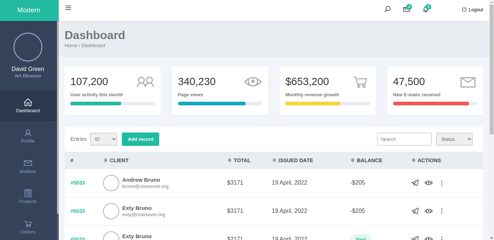
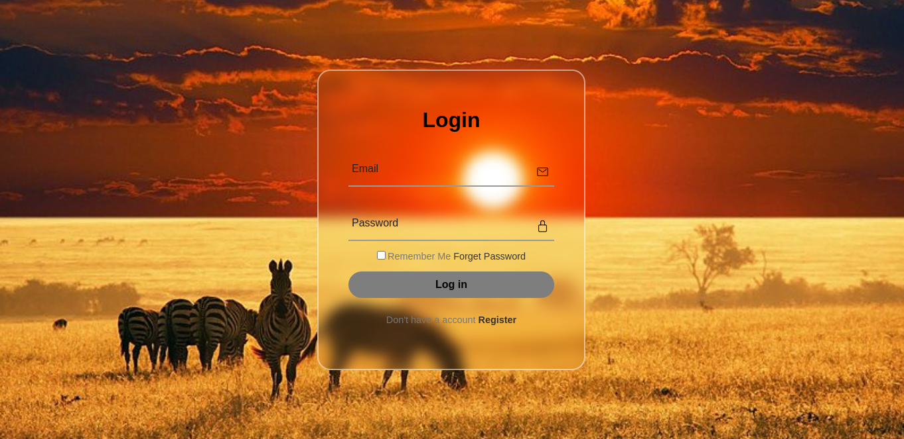
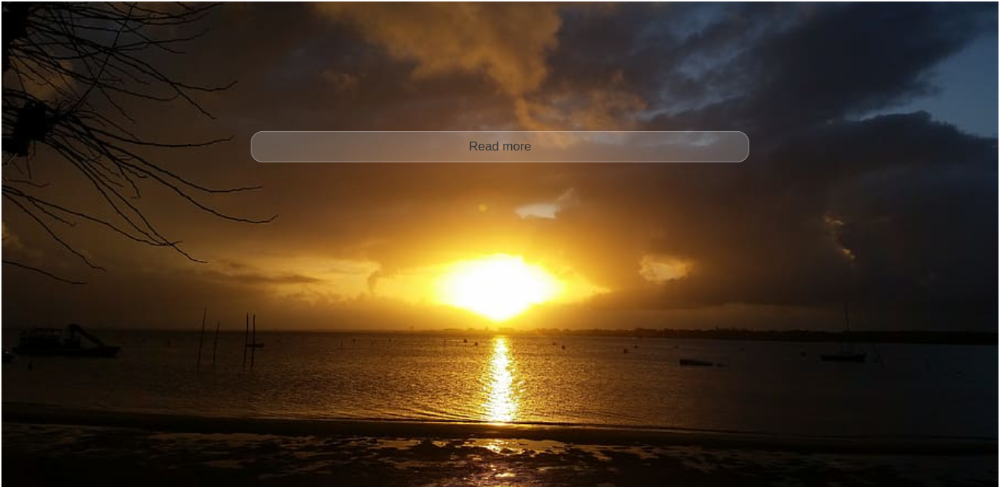

# Public-Project-Materials
### Public Project Materials

<div align="center">
  
   &nbsp; &nbsp;
  [](https://www.linkedin.com/in/silasmugambi/) &nbsp; &nbsp;
  [](https://twitter.com/intent/follow?screen_name=mugambimungiria) &nbsp; &nbsp;
  [](https://#) &nbsp; &nbsp;
  [](https://silasmugambi.pages.dev) &nbsp; &nbsp;
  [](https://github.com/Mugambi12) &nbsp; &nbsp;
   &nbsp; &nbsp;
  [](https://github.com/Mugambi12/Public-Project-Materials)
   &nbsp; &nbsp;

  <br />
  <br />

  <h2 align="center">Public Project Materials</h2>

  These projects are freely available for use in building website.<br />Responsive for all devices, build using HTML, CSS, and JavaScript.

  <a href="https://github.com/Mugambi12"><strong>➥ Live Demo / My Profile</strong></a>

</div>

<br />

### Demo Screeshots





### Prerequisites

Before you begin, ensure you have met the following requirements:

* [Git](https://git-scm.com/downloads "Download Git") must be installed on your operating system.

### Run Locally

To run **these materials** locally, run this command on your git bash:

Linux and macOS:

```bash
sudo git clone https://github.com/Mugambi12/Public-Project-Materials.git
```

Windows:

```bash
git clone https://github.com/Mugambi12/Public-Project-Materials.git
```

### Contact

To contact me, you can reach me out at,<br />
 [Twitter](https://www.twitter.com/mugambimungiria). &nbsp; &nbsp; &nbsp;
 [LinkedIn](https://www.linkedin.com/in/silasmugambi)

### License

[MIT](https://choosealicense.com/licenses/mit/)
